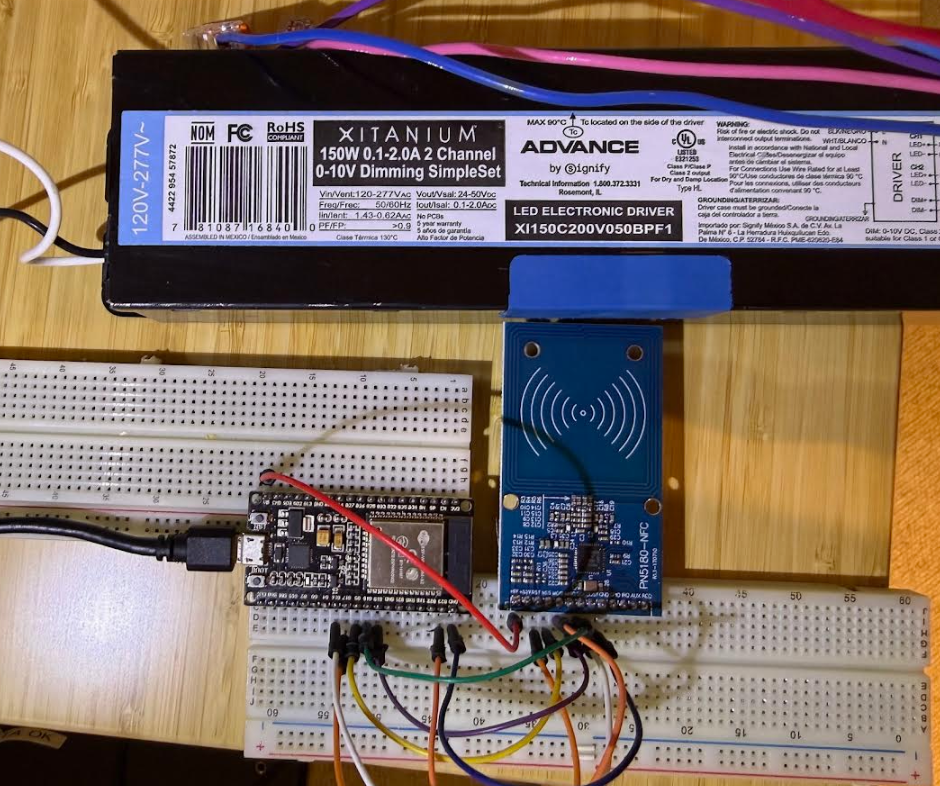

# SimpleSet NFC Configurator

**A ~$20 open-source NFC programmer for SimpleSet NFC-enabled LED drivers** — a
replacement for the [$500+ FEIG CPR30 NFC reader](https://www.feig.de/en/rfid-and-barcode-systems/id-cpr30/)
used by manufacturer configuration tools.

Uses an ESP32 + PN5180 NFC module to read and write LED driver configuration
(output current, device info, etc.) via the ISO 15693 NFC interface. Works
standalone via the CLI tool, or as a read-only drop-in replacement for the FEIG
reader in Signify's [MultiOne](https://www.signify.com/global/support/tools/multione-configurator) software.



## Compatibility

Works with any LED driver that uses an ST M24LR NFC tag (ISO 15693) with the
**SimpleSet** configuration scheme. Known compatible families:

- **Signify Xitanium XI150C** (tested and confirmed working)
- **Signify Xitanium SR** (Sensor Ready) variants
- **Advance Xitanium** SimpleSet models
- Other SimpleSet-labeled drivers from Signify, Advance, or Philips
- Potentially **certaLED** and other NFC-configurable drivers using the same tag

> **Note:** Only the Signify XI150C has been tested so far. Other SimpleSet
> drivers use the same NFC tag hardware (ST M24LR, ISO 15693) and the same
> password mechanism, so they should work with the firmware and password
> extraction. The memory map and register layout may differ between driver
> families — the CLI tool's `dump` command will let you explore any driver's
> NFC memory.

These drivers are readily available and inexpensive on eBay in the US
(search for "Xitanium SimpleSet" or the specific 12NC part number).

## What's Inside

| Component | Description |
|-----------|-------------|
| [`firmware/`](firmware/) | ESP32+PN5180 bridge firmware (Arduino/PlatformIO) |
| [`cli/`](cli/) | Standalone Python CLI to read/write SimpleSet driver config |
| [`bridge/`](bridge/) | Drop-in DLL replacement so MultiOne works with the ESP32 firmware (read-only, see below) |

## Hardware Required

- **ESP32-WROOM-32** dev board — any ESP32 dev board with exposed VSPI pins
  - [Example on Amazon](https://www.amazon.com/Development-30PIN-NodeMCU-ESP32-WROOM-32-CP-2102) (~$9 each, cheaper as 3-pack)
- **PN5180** NFC module — must be PN5180 (not PN532/RC522, which lack ISO 15693)
  - [Example on Amazon](https://www.amazon.com/Rakstore-PN5180-Sensor-ISO15693-Frequency/) (~$13)

Total cost: **~$20 from Amazon** (arrives in days) or **~$5-7 from AliExpress** (1-3 weeks).

### Wiring

> **IMPORTANT: Power the PN5180 from the ESP32's VIN (5V) pin, NOT the 3.3V pin!**
> The PN5180 module has its own onboard 3.3V regulator and expects 5V input.
> Using 3.3V will cause the module to power up but NFC communication will
> silently fail — transactions time out with no error. The VIN pin provides 5V
> directly from USB when the ESP32 is connected to your PC.

```
ESP32          PN5180
─────          ──────
GPIO 23 ────── MOSI
GPIO 19 ────── MISO
GPIO 18 ────── SCK
GPIO  5 ────── NSS (CS)
GPIO 16 ────── BUSY
GPIO 17 ────── RST
VIN (5V) ───── 5V        << NOT 3.3V!
GND    ─────── GND
```

### CP2102 Driver Install (if needed)

If your ESP32 board uses a CP2102 USB chip (most common):

1. Download the driver from [Silicon Labs](https://www.silabs.com/developers/usb-to-uart-bridge-vcp-drivers)
2. Run the installer
3. Plug in your ESP32 via USB
4. Open Device Manager → Ports (COM & LPT) — you should see "Silicon Labs CP210x" on a COM port
5. Note the COM port number (e.g., COM4) for use with the tools

## Quick Start

### Option A: Standalone CLI (no MultiOne needed)

1. Flash the ESP32 firmware (see [`firmware/README.md`](firmware/README.md))
2. Extract passwords from your MultiOne install:
   ```
   cd cli
   pip install pyserial
   python extract_passwords.py "C:\Program Files (x86)\Signify\MultiOne\NfcCommandsHandler.dll"
   ```
3. Use the CLI:
   ```
   python simpleset_cli.py info           # show device info
   python simpleset_cli.py getcurrent     # read current setting
   python simpleset_cli.py setcurrent 800 # set to 800 mA
   python simpleset_cli.py dump           # dump all NFC memory
   ```

**Batch programming tip:** The CLI is fast — place a driver on the reader, run
`setcurrent`, swap the next driver, run it again. No GUI, no waiting. You can
program dozens of drivers in minutes.

### Option B: Use with MultiOne (read-only)

> **⚠️ The MultiOne bridge is incomplete.** It allows MultiOne to detect and
> read the driver via the ESP32, but **writing configuration (e.g. AOC current)
> through MultiOne does not work yet**. MultiOne's internal write logic checks
> memory bank lock bytes and other preconditions that the bridge cannot fully
> satisfy without deeper reverse engineering of the .NET feature DLLs.
>
> **Use the CLI tool (Option A) to write configuration.** It writes directly to
> the NFC tag and is fully working.

1. Flash the ESP32 firmware
2. Run the installer (extracts passwords + installs bridge automatically):
   ```
   install.bat
   ```
3. Launch MultiOne — it will use your ESP32 instead of the FEIG reader

To restore the original FEIG driver:
```
uninstall.bat
```

### MultiOne Download

MultiOne is freely available from Signify:
- [MultiOne Configurator page](https://www.signify.com/global/support/tools/multione-configurator)
- [Direct download: MultiOne Engineering 3.36](https://www.assets.signify.com/is/content/Signify/Assets/signify/global/multione/20260319-multione-engineering-3.36.zip)

> **Note:** These links may become stale. If they don't work, search Signify's
> website for "MultiOne configurator download". You need the **Engineering**
> edition (not Workflow) for full access to AOC current settings.

## How It Works

SimpleSet LED drivers contain an ST M24LR NFC tag
(ISO 15693) that stores configuration data in 64 blocks of 4 bytes each. The
tag uses password-protected sectors:

1. **Sector 0 (blocks 0-31)**: Device info, current setting, version, 12NC
2. **Sector 1 (blocks 32-63)**: Extended config, AOC mailbox, dirty flags

The ESP32+PN5180 firmware acts as a serial-to-NFC bridge. Host tools send simple
commands over USB serial, and the ESP32 translates them into ISO 15693 NFC
transactions.

The **bridge DLL** (`NfcCommandsHandler.dll`) implements the same API as the
original FEIG-based DLL, so MultiOne sees the ESP32 as if it were a FEIG reader.

## Password Extraction

The RF passwords needed to access the LED driver's NFC memory are embedded in
Signify's original `NfcCommandsHandler.dll`. The `extract_passwords.py` utility
extracts them from your own copy — **no passwords are included in this
repository**.

You need a legitimate copy of MultiOne (freely downloadable from Signify) to
extract the passwords.

> **Note on "passwords":** These are not encrypted or obfuscated in any way.
> They are stored as **plain ASCII text strings** sitting openly in the DLL
> binary — literally readable by anyone who opens the file in a hex editor or
> runs the `strings` command. The extraction tool simply automates finding these
> plain-text strings so you don't have to search manually. There is no "hacking"
> or circumvention involved — the ST M24LR datasheet publicly documents the
> password presentation mechanism (ISO 15693 custom command 0xB3), and the
> passwords themselves are unprotected strings in a DLL that ships with freely
> available software.

## Tested With

- Signify Xitanium XI150C 200V 050 BPF1 SimpleSet LED driver
- Signify MultiOne Engineering 3.36
- ESP32-WROOM-32 (DevKitC v4) with CP2102
- PN5180 NFC module

## Built With AI

This entire project — firmware, CLI tool, bridge DLL, build scripts, and
documentation — was written by AI (Claude, Anthropic). No human-written code;
just prompting, testing, and directing. The reverse engineering, protocol
analysis, and discovery of the password slot mutual exclusion behavior were all
done through AI-guided experimentation.

## License

MIT License. See [LICENSE](LICENSE) and [DISCLAIMER](DISCLAIMER.md).

This project is not affiliated with Signify, Philips, or FEIG Electronic.
