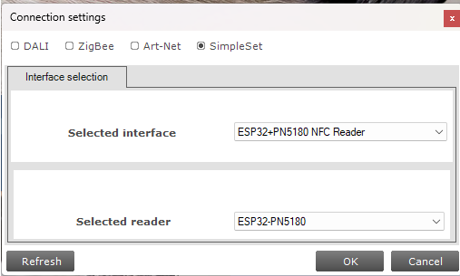
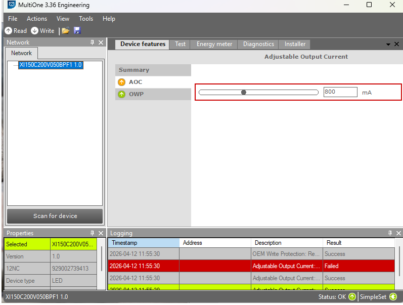

# MultiOne Bridge — ESP32 NFC Driver for MultiOne

Drop-in replacement for the FEIG-based `NfcCommandsHandler.dll` in Signify
MultiOne. Redirects all NFC operations to an ESP32+PN5180 over USB serial,
allowing MultiOne to work with a ~$5 NFC reader instead of a
[$500+ FEIG CPR30](https://www.feig.de/en/rfid-and-barcode-systems/id-cpr30/).

## Screenshots

Once installed, MultiOne detects the ESP32 as "ESP32+PN5180 NFC Reader" in the
connection settings:



MultiOne works normally — reading device info, adjusting output current, and
writing configuration, all through the ESP32:



## Quick Install

```
install.bat
```

This will:
1. Find your MultiOne installation
2. Back up the original DLL as `NfcCommandsHandler.dll.original`
3. Extract the RF password from the original DLL
4. Install the bridge DLL and configuration file

## Quick Uninstall

```
uninstall.bat
```

Restores the original FEIG-based DLL.

## Manual Install

1. Navigate to your MultiOne installation directory
2. Rename `NfcCommandsHandler.dll` to `NfcCommandsHandler.dll.original`
3. Copy `bin\NfcCommandsHandler.dll` to the MultiOne directory
4. Create `multione_bridge.ini` in the MultiOne directory:
   ```ini
   port=COM4
   password=AABBCCDD
   ```
   Replace `COM4` with your ESP32's port and `AABBCCDD` with your extracted password.

## Configuration

The bridge reads `multione_bridge.ini` from the same directory as the DLL:

```ini
port=COM4
password=AABBCCDD
```

| Key | Description | Default |
|-----|-------------|---------|
| `port` | COM port for ESP32 | Auto-scan COM3-COM20 |
| `password` | RF password (8 hex chars) | Required |

The password can also be provided via:
- `multione_bridge.ini` (recommended)
- `passwords.json` in the same directory
- `SIGNIFY_RF_PASSWORD` environment variable

## Building from Source

Requires Visual Studio Build Tools (MSVC) or MinGW-w64 (32-bit):

```
build.bat
```

The bridge must be compiled as a **32-bit DLL** to match MultiOne's 32-bit
architecture (this matters — a 64-bit DLL will not load).

### MSVC
```
cl /nologo /O2 /LD /W3 multione_bridge.c /Fe:NfcCommandsHandler.dll /link /DEF:multione_bridge.def kernel32.lib user32.lib advapi32.lib
```

### MinGW-w64 (32-bit)
```
i686-w64-mingw32-gcc -shared -O2 -Wall -o NfcCommandsHandler.dll multione_bridge.c multione_bridge.def -lkernel32
```

## Exported Functions

The bridge exports all 17 functions from the original DLL:

| Export | Purpose |
|--------|---------|
| Connect | Open serial port to ESP32 |
| Disconnect | Close serial port |
| DetectDevice | Inventory + present password |
| IsConnected | Check connection status |
| ReadBlock | Read single NFC block |
| WriteBlock | Write single NFC block |
| ReadBlockSecurity | Get block security status |
| ResetSecurity | Reset RF field |
| SetOdmId | Set ODM ID (password set selector) |
| GetSupportedReaders | Returns "ESP32+PN5180" |
| SetSelectedReader | No-op (only one reader) |
| GetDllVersion | Returns bridge version |
| GetFirmwareRevision | Returns PN5180 firmware version |
| GetHardwareName | Returns "ESP32+PN5180" |
| GetHardwareVersion | Returns PN5180 product version |
| RefreshConnection | Reconnect if needed |
| FreeScanForReaderReturnValue | Memory cleanup |

## Logging

All NFC operations are logged to `multione_bridge.log` in the DLL's directory.
Useful for debugging communication issues.

## Files

| File | Description |
|------|-------------|
| `multione_bridge.c` | Bridge source code |
| `multione_bridge.def` | Module definition (exports) |
| `build.bat` | Build script |
| `install.bat` | Installer |
| `uninstall.bat` | Uninstaller |
| `bin/NfcCommandsHandler.dll` | Pre-built 32-bit DLL |
